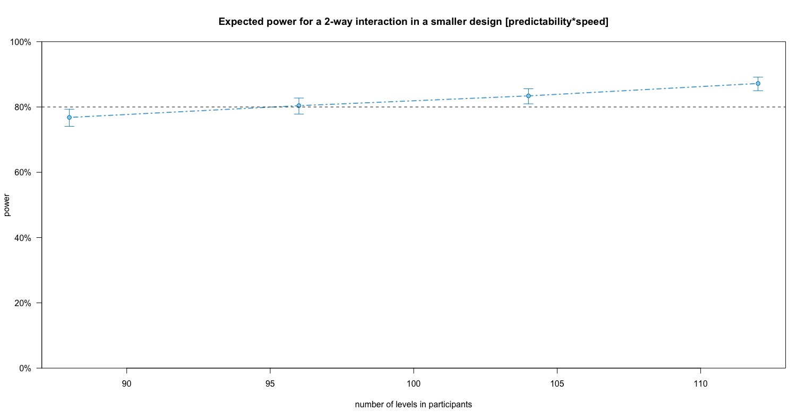

# Setup

```{r setup, cache=FALSE, eval=TRUE, echo=TRUE}
set.seed(2022)

suppressPackageStartupMessages(library(tidyr))
suppressPackageStartupMessages(library(dplyr))
suppressPackageStartupMessages(library(simr))
```

```{r load_data, echo=FALSE, eval=TRUE, cache=FALSE}
load('power.RData')
```


# Createa a fake data

Let's say we have already run a pilot experiment so that we can conduct a well-powered experiment for a study that we can publish and/or write in our thesis.

-   Within group design, with n=26

-   2 conditions:

    -   Noise: Mild and Severe
    
    -   Cloze: High and Low
    
-   10 items in a repeated measures design

In this hypothetical experiment with 26 participants, each participant listens to 40 sentences. These sentences are embedded in background noise which is Mild or Severe. The [cloze probability](https://doi.org/10.1177/107769905303000401) of the sentence final words are High or Low.

```{r fakedata, cache=TRUE, eval=TRUE, echo=TRUE}

dat <- expand_grid(
  participants = paste(letters, 1:26, sep = '_'),
  noise = c('mild', 'severe'),
  cloze = c('high', 'low'),
  item = paste('item', 1:10, sep = '_'))
dat$acc <- sample(c(0,1), nrow(dat), replace = T)

# Assign class to the variables of interest:
dat$noise <- as.factor(dat$noise)
dat$cloze <- as.factor(dat$cloze)
dat$acc <- as.integer(dat$acc)
```

Note that these conditions are only labels and accuracy (`acc`) can be high or low in any of these conditions because no weight (more/less) is assigned to any condition.

## Summary of the data

```{r dat_summary, cache=TRUE, eval=TRUE, echo=TRUE}
dat %>% 
group_by(., participants, noise,cloze) %>%
  summarise(totalCorr=sum(acc==1), totalIncorr=sum(acc==0), .groups = 'keep') %>% #.groups is experimental, so mind it in future versions of dplyr
  mutate(total=totalCorr+totalIncorr,
         accuracy=round(((totalCorr/(totalCorr+totalIncorr))*100), digits=2))
```

# Mixed effects model

## Contrasts and model matrices

Let's use treatment contrast.

```{r contrasts, eval=TRUE, echo=TRUE, cache=TRUE}
contrasts(dat$cloze) <- contr.treatment(2) # High cloze is the baseline, i.e., at the intercept term
contrasts(dat$noise) <- contr.treatment(2) # Mild noise is the baseline
```

<!--It is better to use the contrasts as numerical covariates. So,

```{r model_matrix, eval=TRUE, echo=TRUE, cache=TRUE}
mm <- model.matrix(~ cloze*noise, data = dat)

clozeDiff <- mm[,2]; #difference betwn high and low cloze at the baseline of noise (i.e., at Mild noise)
noiseDiff <- mm[,3]; #difference betwn mild and severe at the baseline of cloze (i.e., at High cloze )
intrxn <- mm[,4] #interaction
```
-->

## Run the model

```{r m0, eval=FALSE, cache=TRUE, echo=TRUE}
m0 <- glmer(acc ~ 1 + (cloze + noise + cloze:noise) +
                   (1 | participants) + (1 | item), 
                 data=dat, family = "binomial", 
                 control = glmerControl(calc.derivs = FALSE, optimizer="bobyqa", optCtrl = list(maxfun=1e6)),
                 nAGQ = 0, na.action = na.exclude)
```

```{r m1, eval=FALSE, cache=TRUE, echo=FALSE}
m1 <- glmer(acc ~ 1 + (clozeDiff + noiseDiff + intrxn) +
                   (1 | participants) + (1 | item),
                 data=dat, family = "binomial",
                 control = glmerControl(calc.derivs = FALSE, optimizer="bobyqa", optCtrl = list(maxfun=1e6)),
                 nAGQ = 0, na.action = na.exclude)
```

By the way, is this model appropriate for the repeated measures? Each participant sees each item 4 times, i.e., once in each of the 4 experimental conditions.\
Let me know.

## Model summary

```{r m0_summary, eval=TRUE, echo=TRUE, cache=TRUE}
summary(m0)
```


# Observed and expected effect size

Say, I am interested in the effect size of the difference between mild and severe conditions, i.e., `noise2` in the model output.

The observed effect size in log odds scale is:

```{r obs_eff_size, eval=FALSE, echo=TRUE, cache=TRUE}
fixef(m0)[3] #fixef(m0)['noise2']
```

```{r obs, eval=TRUE, echo=FALSE, cache=TRUE}
obs
```


The direction is negative, meaning that the accuracy at Severe noise condition tends to be lower than at Mild noise condition. Remember that this was not intended, as these data come from a random distribution without higher weight given to any of these two noise conditions.

Now let's say, that my effect size of interest is not `r fixef(m0)['noise2']`, but it is `0.05`.

```{r expected_eff_size, eval=FALSE, echo=TRUE, cache=TRUE}
fixef(m0)['noise2'] <- 0.05 #changed from -0.04701666 to 0.05

# If I assume the effect size will not change in the "real data", then I'll run: `fixef(m0)['noise2'] <- fixef(m0)['noise2']` instead.
```

# Increased sample size and 'new' model

Lets follow the these steps to increase the number of participants and rerun the experiment (well, not actually rerun).
With increased sample sizes, we will simulate what the power is to detect the effect size of interest.
Current sample size, in this pilot study (the fake data), is 26. We want to find out what the power is when the increased sample sizes in the real experiment range from 32 to 160. We will test for five different sample sizes (32, 64, 96, 128, and 160). I selected these numbers randomly here.

```{r simulation_vars}
N_tar_grid    <- seq(32, 160, by = 32) # five different sample sizes
# N_tar_grid_simr <- N_tar_grid * 1 # not necessary, strictly speaking

fit_ext_simr0  <- simr::extend(m0, #increases sample size for 'm0'
                              along = "participants",
                              n = max(N_tar_grid)
                              )

# fit_ext_simr1  <- simr::extend(m1,
#                               along = "participants",
#                               n = max(N_tar_grid),
#                               )
```

We can check that the increased sample size is indeed 160 which can be extracted from the model `fit_ext_simr`.

```{r check_increased_N, eval=TRUE, cache=TRUE, echo=TRUE}
getData(fit_ext_simr0) %>% group_by(participants, acc) %>% count() %>%
  pivot_wider(names_from = acc, values_from=n) %>%
  mutate(tot=`0`+`1`, accuracy=`1`*100/tot)
```
 
# Power curve

<!--We will test if our sample sizes can detect the effect of interest with 80% power.
For this, we will create a power curve: We can see the power at different sample sizes.

To get there by running the model and specifying the parameter for which we want effect size to be calculated thousand of times.-->
First, we'll do a power analyses from the existing (extended) data and the model.

```{r powersim, cache=TRUE, eval=FALSE, echo=TRUE}
B_boot <- 100 # number of boot repetitions within one experiment, one setup; at least ONE THOUSAND

noise_power0 <- simr::powerSim(fit_ext_simr0,
                               nsim = B_boot,
                               progress = TRUE,
                               test = fixed('noise2', 'z'))
```

```{r existing_power, echo=FALSE, eval=TRUE, cache=TRUE}
noise_power0
```

This shows the existing power to reject the null hypothesis is about 5\%.

Next, we'll simulate the power across different sample sizes to see if any of the sample sizes can provide 80% power for the effect size we specified above.

```{r get_powercurve, echo=TRUE, eval=FALSE, cache=TRUE}
noise_powercurve0 <- simr::powerCurve(fit_ext_simr0,
                            along = 'participants',
                            nsim = B_boot,
                            breaks = N_tar_grid, #seq(32, 160, by = 32)
                            progress = TRUE, 
                            test = fixed('noise2', 'z'))
```

## Power curve visualization

First, let's find out the power for `noise` at different sample sizes we prespecified above. Then plot it.

```{r table_powercure, eval=TRUE, cache=TRUE, echo=TRUE}
noise_powercurve0
```

**We have a problem!!**\
The power for a sample size of 99 is higher than that for 127. Most likely because I only ran 100 simulations, and some sets of simulations were likely to be poor fit. Had there been tens of thousands of simulations then a few misfit data set would not be such a problem.

So, try to run some thousands simulations, i.e. change `B_boots=10000` above. If this does not solve the problem then something else is wrong.

Anyway, the next step is to plot the output from `powerCurve`.

```{r plot_powercurve, eval=FALSE, cache=TRUE, echo=TRUE}
plot(noise_powercurve0)
# plot(noise_powercurve1)
```

It should ideally have given a plot like the following one (but it won't right now; increase the number of simulations first):
<!--[alt text here](path-to-image-here)-->

```{r powercurve, echo=FALSE, fig.cap="An example of powercurve.", out.width = '100%'}

```


This is a real powercurve that I'd prepared for one of my experiments.\
It shows how power (y-axis) increases with an increase in sample size (x-axis).
In this experiment, I needed a sample size of at least 96 to detect the effect size of interest for *predictability x speed* interaction with 80% power.\

# Conclusion

In our hypothetical experiment, at this point, we can't really say how many participants we should recruit for a well-powered study to detect effect size of interest re the variable `noise`. Try runnig 10000 simulations and see. Also, is the model specification correct for the repeated measures?

There are many factors that determine the result of your sample size estimation for an effect size of interest. For example, did you assign and interpret correct contrasts? Are you interested in the effect size of only one variable or more? How do you take into account the random effects? All these questions deserve separate discussion, I believe. But for now, we can work with this seemingly simple case.\
All the best!

And enjoy [this piece](https://www.youtube.com/watch?v=JwFNShcDlh8) titled *Hearing noises* 🎶🔊

# Notes

-   Many researchers disagree with this approach of sample size estimation from a pilot study. Be mindful of their criticism and feedback.

-   We can get post-hoc power of a variable using the `powerSim` command in m0 instead of extended model as done above. Be careful why you perform post-hoc power analysis and check its critiques.

- Almost everything covered in this tutorial comes from [Green and MacLeod (2016)](https://doi.org/10.1111/2041-210X.12504), and [Karas and Crainiceanu (2021)](https://github.com/martakarass/upstrap_manuscript).

<!-- -   Please do comment if you find mistakes above, or improvements can be made.

- Thanks for reading. -->


```{r save, echo=FALSE, eval=FALSE, cache=TRUE}
save.image(file = 'power.RData')
```

